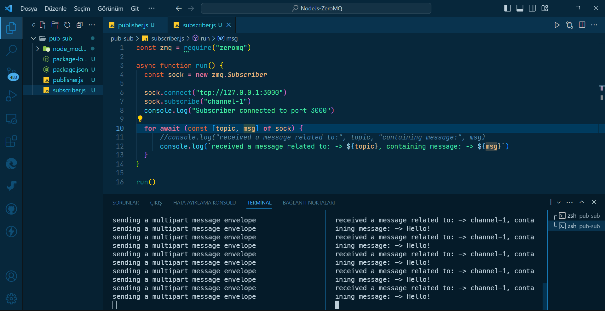

# `NodeJs & ZeroMQ`

<div align="center">
    
</div>

- A simple ZeroMQ (pub/sub) example with Node.js

### This project uses the following packages:

[](https://nodejs.org/)

[](https://zeromq.org/)

<br>

### Usage

```bsh
node publisher.js
```

```bsh
node subscriber.js
```

<br>

# License

This project is licensed under the MIT License. See the [LICENSE](LICENSE) file for details

Created by [Mehmet Furkan KAYA](https://www.linkedin.com/in/mehmet-furkan-kaya/)
